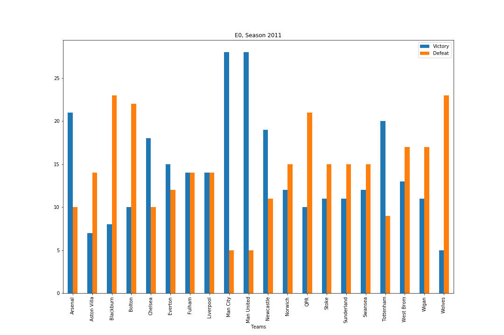
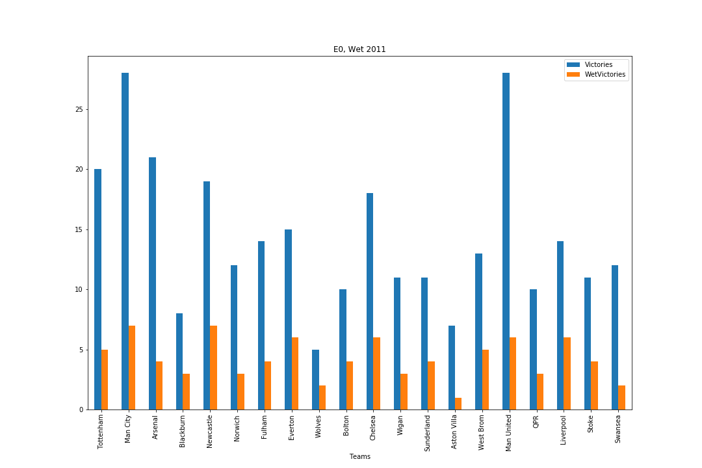
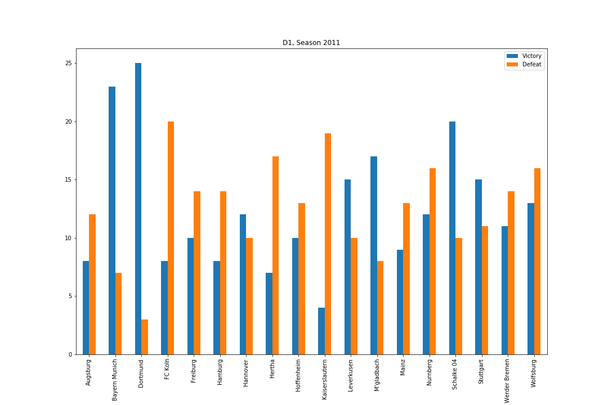
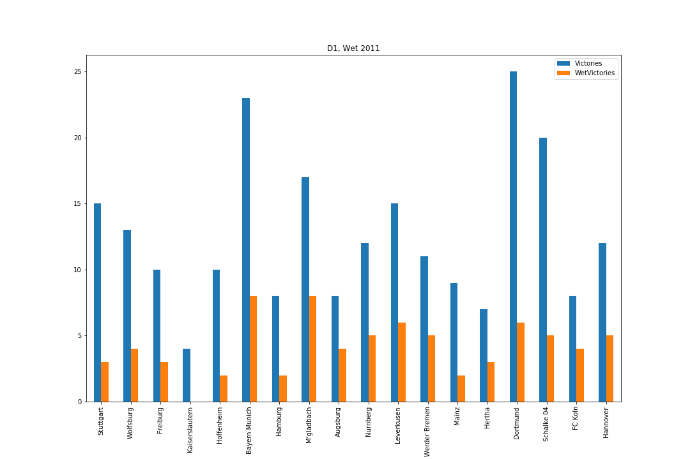
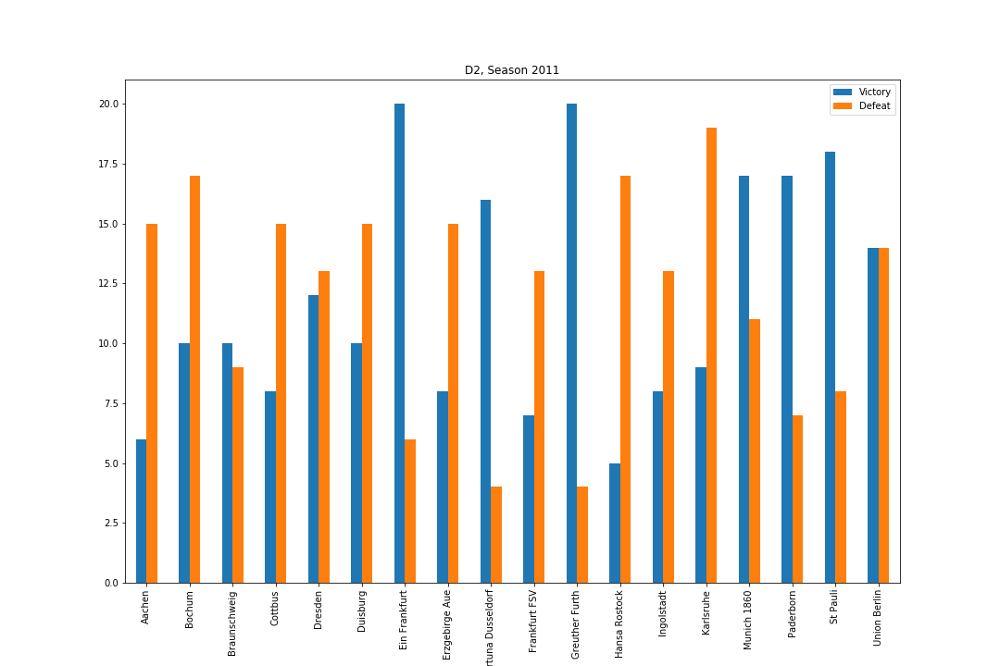
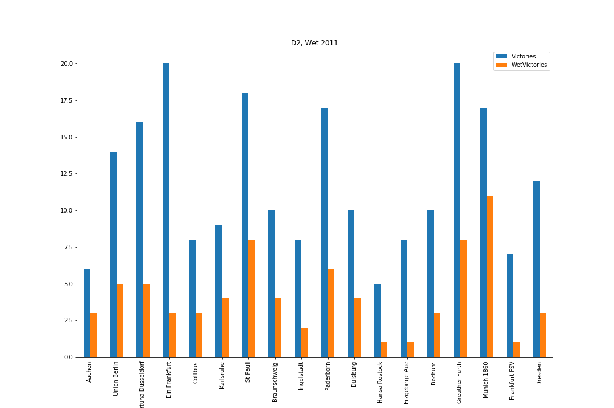

# Introduction
For the season 2011, 56 teams are spread across the Premier League (20 teams), the Bundesliga (18 teams) and the Bundesliga 2 (18 teams). Only victories and defeats are accounted for, draws were left aside for this analysis. The weather data was collected thanks to the [DarkSky API](https://darksky.net/dev/docs#overview) and we've focussed on the `daily` data block of the response, more specifically the `icon` field (which returns a string). The location was defaulted to London for the British teams and Berlin for the Germans teams.

# Premier League
38 matches were played during the season and Manchester City won the title with 89 points. It was a very tight season and Manchester United also finishes the season at 89 points (28W/5D/5L) but only had a goal average of 89-33 vs 93-29 for Manchester City. The third team is Arsenal with 70 points (12W/7D/10L).

Looking at the weather, ManCity has won 7 games, ManU 6 and Arsenal 4. The rain didnt affect the top 3 order but it is worth noting teams such as Liverpool and Everton have a higher percentage of WetWins, mainly due to the fact that their total match won is lower.

# Bundesliga
34 matches were played during the season. Borussia Dortmund won the title with 81 points (25W/6D/3L) followed by Bayern Munich with 73 point (23W/4D/7L) and Schalke 04 with 64 points (20W/4D/10L).

Less matches were played during rainy days compared to the Premier League but, here, the top 3 is inverted. Most likely due to the total of match won being lower the more you go down the standings.

#Bundesliga 2
34 matches were played during the season. SpVgg Greuther Furth won the title with 70 point (20W/10D/4L), Eintracht Frankfurt is second with 68 points (20W/8D/6L) and Fortuna Dusseldorf finishes at the third place with 62 points (16W/14D/4L).

In the rain Greuther Furth was the most performant team, wining 40% of their games in the rain. The other 2 top 3 teams have a very low percentage of wet victories. Probably showing that playing on a dry day has had a positive effect on those teams performance. Worth noting, Munich 1860 which ends up in the 6th place afeter winning 11 of their 17 matches in the rain.

# The effect of rain on match outcome

Although it seems the teams at the top of the season ranking tend to be in the lower part of the wet table, it is mainly due to the fact that teir total victory is higher than other teams. Only Munich 1860 (Bundesliga 2) seem to enjoy the rain more than any other team.

